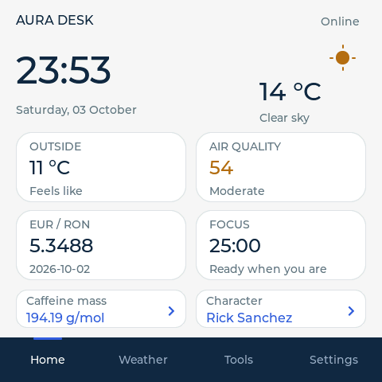
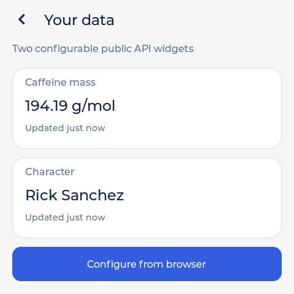
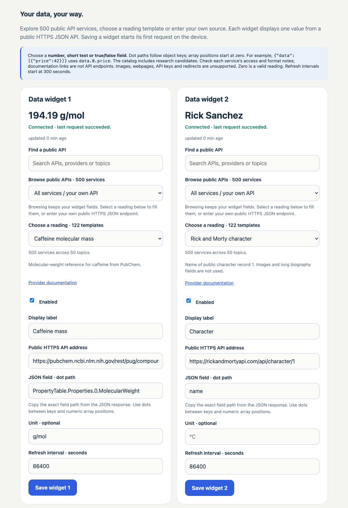
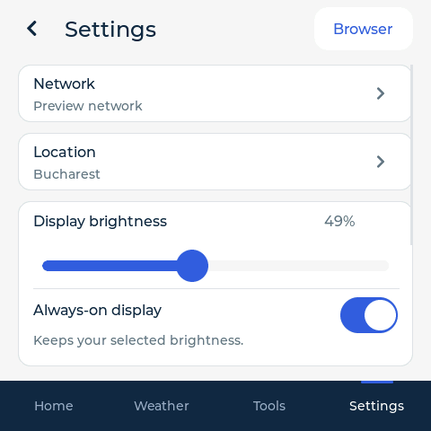

# AURA Desk — ESP32-S3 Touchscreen Firmware

An internet-connected desk dashboard with the original **Horizon** interface, built for the **Jingcai / Guition ESP32-4848S040C_I_Y_3**: a 480 × 480 ST7701 RGB display, GT911 touch, 16 MiB flash and 8 MiB OPI PSRAM.

**Current firmware: 1.0.7** · [Browser autocomplete update](https://github.com/rlvphotoart/esp32-s3-touchscreen-aura-desk/releases/tag/v1.0.7) · [Setup and manual](docs/AURA_DESK.md) · [API catalog](docs/PUBLIC_API_SERVICES.md) · [Resolved Issues](https://github.com/rlvphotoart/esp32-s3-touchscreen-aura-desk/issues?q=is%3Aissue%20is%3Aclosed%20label%3Ahistory)

**1.0.7 autocompletes API setup in the browser companion.** Selecting a ready-to-use service fills its public HTTPS address and JSON field immediately. Review the reading, then press **Save widget**. The default **Ready-to-use APIs only** view includes verified Meteo.lt and Jolpica F1 defaults; turn it off to explore the full discovery catalog. Install the application through the existing HTTPS update form over Wi-Fi; no serial cable is needed. [Autocomplete update and verification](docs/BROWSER_AUTOCOMPLETE_1.0.7.md)

AURA connects to your 2.4 GHz Wi-Fi router and puts the clock, weather, air quality, reference exchange rates, timers and your own API readings on the touchscreen. Its local HTTPS browser companion manages settings, searches public APIs and installs application updates.

| Public API services | Topics | Reading templates | On-screen widgets |
| ---: | ---: | ---: | ---: |
| **500** | **50** | **124** | **2** |

## The current interface

| Home — custom API readings at a glance | Your data — complete readings and update ages |
| --- | --- |
|  |  |

The Home image is an unedited ESP32-rendered frame captured during final 1.0.5 verification, before the owner's original widgets were restored. Your data is rendered from the same release's LVGL source with the same public example readings. [Screenshot sources](docs/SCREENSHOTS.md)

## Your data, your way

The browser companion offers **500 searchable services in 50 categories**. Each entry explains its provider, documentation, access requirements, formats and setup needs. The separate reading selector provides **124 ready URL-and-field templates**, including 22 additional services introduced in 1.0.5 and two defaults added in 1.0.7.



This is the 1.0.5 companion running with safe demo status data, before 1.0.6 added **Use this API** and nearby Save, and 1.0.7 added automatic field completion and the ready-only view. The preview makes no requests to the device or providers.

1. Open **Settings → Browser** on the touchscreen, then visit the local HTTPS address shown there from a phone or computer on the same router.
2. Enter the displayed six-digit pairing code. Search and select an API from the default **Ready-to-use APIs only** view. Its compatible reading fills the HTTPS address and JSON field automatically; choose another reading when needed. **Use this API** reapplies the selected reading. Turn off the ready-only filter to explore all 500 services. A discovery entry without a reading needs a verified endpoint and field; Use opens its manual form.
3. Select a number, short text or boolean using its JSON dot path. Array positions start at zero: `data.0.price` reads the first item's price. Set an optional unit and a refresh interval of at least 300 seconds.
4. Enable the widget and press **Save widget** beside the reading selector or at the bottom of the form. Saving starts its first device request. Searching and filter changes preserve your edits; selecting a ready service prepares its reading without saving. Save catches an unapplied discovery entry so it cannot silently submit the previous API. Each request's result and any error appear on the card.
5. See both enabled readings on **Home**. Tap a tile to open **Your data** with full values, units, update ages and independent errors.

**Catalog scope:** 41 of the 500 services have 117 associated reading profiles. Seven original GitHub/TimeAPI.io choices remain available independently, bringing the total to 124. The other 459 services provide discovery and custom-configuration guidance. API keys, image responses, redirects and non-JSON formats require work beyond the current scalar reader. Catalog inclusion does not establish a working integration for every provider endpoint. [Catalog evidence](docs/API_SERVICES_VALIDATION.md) · [1.0.7 additions](docs/BROWSER_AUTOCOMPLETE_1.0.7.md)

## A display that fits your desk



**Always-on display** keeps your selected brightness. Turning it off restores dimming after three minutes without touch, to one-fifth of the chosen level with a 10% floor. The preference is saved and can be changed from the touchscreen or browser.

The Settings header keeps **Browser** accessible, so you can reopen the local address and pairing code whenever you need them. This screenshot is a current-source LVGL preview with demo network/location settings.

## What the firmware includes

| Area | Functions |
| --- | --- |
| Connection | Touchscreen Wi-Fi setup, scanning, saved credentials and automatic reconnection |
| Time | Network clock/calendar, editable city and supported daylight-saving rules |
| Weather | Open-Meteo conditions, three forecast days, sunrise/sunset, European AQI and PM2.5 |
| Reference rates | Dated ECB EUR/RON and EUR/USD readings |
| Your APIs | Two public HTTPS JSON widgets, scalar/array dot paths, saved readings, refresh ages and independent error feedback |
| Tools | Focus sessions with 25/50-minute presets, separate 5/15-minute countdowns and a monotonic stopwatch |
| Display | Saved brightness and Always-on choice |
| Browser | Local paired HTTPS, settings export, device health and verified application OTA |

Source dates and data ages stay visible. Invalid values remain unavailable; a failed refresh can retain the last successful reading with its age and error. Provider terms and quotas still apply. Open-Meteo hosted free access is for personal, non-commercial use. [Provider and platform limits](docs/AURA_DESK.md)

## Download and first setup

For an existing AURA Desk installation, get the [1.0.7 browser autocomplete update](https://github.com/rlvphotoart/esp32-s3-touchscreen-aura-desk/releases/tag/v1.0.7): the application-only `AuraDesk.ino.bin`, its SHA-256 checksum and the browser validation report. This maintenance release uses the same board, partition layout, API backend and touchscreen behavior.

For a first installation or the complete baseline archive, get the [verified 1.0.5 release](https://github.com/rlvphotoart/esp32-s3-touchscreen-aura-desk/releases/tag/v1.0.5):

| File | Use |
| --- | --- |
| `AuraDesk.ino.bin` | Application-only update through the device's browser OTA form |
| `AuraDesk.ino.merged.bin` | 16 MiB factory image for the exact supported board and custom layout |
| `AURA-Desk-1.0.5.zip` | Firmware, release source snapshot, build layout, dependency locks/licenses and validation reports |
| Catalog and validation JSON assets | Machine-readable API evidence and release conclusions |
| SHA-256 files | Integrity checks for the archive and packaged files |

Connect using **Settings → Network** and a 2.4 GHz router. Set your weather city in **Settings → Location**, choose display brightness/Always-on, then pair the browser to configure your two API widgets.

Use only the matching board and flash layout. Factory flashing replaces stored settings; first take and verify a complete backup. Ordinary Arduino CLI upload offsets differ from this project's layout. Use application-only browser OTA for later updates. [Build and flashing guide](docs/FIRMWARE_BUILD.md) · [Recovery](docs/RECOVERY.md)

Release hashes establish integrity; releases are not publisher-signed. Firmware release assets and tags preserve their verified snapshots; this front page and issue history receive later documentation updates.

## Verified on the device

The browser maintenance checks are recorded in [1.0.7 autocomplete verification](docs/BROWSER_AUTOCOMPLETE_1.0.7.md) and [1.0.6 selection verification](docs/BROWSER_SELECTION_FIX_1.0.6.md). The full hardware/API/display baseline below remains the separately dated **1.0.5** acceptance record.

The final 1.0.5 application passed paired, certificate-pinned HTTPS installation, image readback and three consecutive healthy restarts. Router, location, widgets and display preferences were compared before/after the update and preserved.

- **All 22 additional reading profiles** returned HTTP 200 and valid bounded scalars on the ESP32.
- **Native Safari** passed both catalog selectors, search, draft preservation, representative new Save/fetch flows in both widget slots, reload and saved-source recognition.
- **Actual ESP32-rendered Home and Your data frames** independently matched both configured labels, values and units. Frame checks are separate from browser success.
- **All 15 release assets** were downloaded anonymously and matched the local release bytes and SHA-256 hashes.
- Offline coverage includes **25,521 catalog checks**, **16,732 embedded-browser assertions**, production C++ profile checks and all **14 LVGL pages**.

All 22 new live profiles were checked in slot 0, with representative Save/display coverage in both slots. The original 100-profile provider evidence is dated to 1.0.4; all 100 were not fetched on the final 1.0.5 ESP32 image. Rendered frames are distinct from optical panel measurements and manual physical touch tests. [Release validation](docs/RELEASE_VALIDATION.md) · [API service verification](docs/API_SERVICES_VALIDATION.md)

## Issues and how they were fixed

The [GitHub Issues history](https://github.com/rlvphotoart/esp32-s3-touchscreen-aura-desk/issues?q=is%3Aissue%20is%3Aclosed%20label%3Ahistory) records symptoms, diagnosis, the implemented fix, source commits and verification evidence. Historical entries were added retrospectively on **4 October 2026**; their bodies preserve the actual release validation dates.

| Problem or request | What changed | Issue / delivery |
| --- | --- | --- |
| Screen dimmed with no user choice | Saved Always-on switch on device and in browser | [#2](https://github.com/rlvphotoart/esp32-s3-touchscreen-aura-desk/issues/2) · 1.0.1 |
| Open timer kept a 5/15-minute countdown | Explicit Focus entry and working 25/50-minute presets | [#3](https://github.com/rlvphotoart/esp32-s3-touchscreen-aura-desk/issues/3) · 1.0.2 |
| Browser address/code was difficult to reopen | Visible Settings header shortcut and preserved scroll | [#4](https://github.com/rlvphotoart/esp32-s3-touchscreen-aura-desk/issues/4) · 1.0.2 |
| API values appeared in browser but not Home | Two Home tiles linked to full Your data details | [#5](https://github.com/rlvphotoart/esp32-s3-touchscreen-aura-desk/issues/5) · 1.0.3 |
| API choices lacked breadth and setup context | 500-service discovery catalog and 122 separate reading templates | [#8](https://github.com/rlvphotoart/esp32-s3-touchscreen-aura-desk/issues/8) · 1.0.5 |
| GBIF rejected the broad TLS cipher offer | Four standard ECDHE AES-GCM suites with certificate verification retained | [#9](https://github.com/rlvphotoart/esp32-s3-touchscreen-aura-desk/issues/9) · 1.0.5 |
| Browsing a service left the old API in the Save form | Explicit Use action, nearby Save, clean manual setup and a draft mismatch check | [#11](https://github.com/rlvphotoart/esp32-s3-touchscreen-aura-desk/issues/11) · 1.0.6 |
| Selected APIs required manual address/field entry | Automatic ready-service field completion, a ready-only view, and verified Meteo.lt/Jolpica defaults | [#12](https://github.com/rlvphotoart/esp32-s3-touchscreen-aura-desk/issues/12) · 1.0.7 |

[Full issue and improvement history](docs/ISSUE_HISTORY.md) also covers startup stability, Safari request/session handling, the rate-limited Bitcoin example and this repository refresh. Earlier failed requests remain recorded alongside successful final repeats; an unexplained provider failure is not presented as a diagnosed repair.

For a new problem, [open an issue](https://github.com/rlvphotoart/esp32-s3-touchscreen-aura-desk/issues/new) with firmware version, board model, steps, expected/actual behavior and any non-sensitive error text. Keep Wi-Fi credentials, local addresses, pairing/session material, certificates and full-flash backups out of issue attachments.

## Build and verify

The isolated toolchain pins Arduino-ESP32 **3.1.1**, its matching official high-performance SDK, ESP32_Display_Panel, LVGL **8.4.0** and ArduinoJson **7.4.2**. The SDK uses PSRAM XIP; usable heap PSRAM is smaller than physical capacity. Follow [FIRMWARE_BUILD.md](docs/FIRMWARE_BUILD.md) and [SETUP.md](docs/SETUP.md) for the pinned local environment.

```sh
./scripts/build.sh
.venv/bin/python tools/render_ui.py
.venv/bin/python tools/test_widgets.py
.venv/bin/python tools/test_widget_browser.py
.venv/bin/python tools/test_http_response_policy.py
.venv/bin/python tools/test_api_catalog.py
.venv/bin/python tools/generate_api_catalog.py --check
.venv/bin/python tools/generate_api_services.py --check
.venv/bin/python tools/test_api_services.py --self-test --backend
.venv/bin/python tools/test_https_tls_policy.py
.venv/bin/python tools/test_package_release.py
```

Identity-checked device maintenance uses your own runtime configuration:

```sh
export ESP32_PORT='<your-serial-port>'
export AURA_EXPECTED_MAC='<your-board-mac>'
./scripts/backup_flash.sh
./scripts/verify_backup.sh
./scripts/restore_original.sh  # review only; execution requires its explicit flag
```

No owner-specific device identity, local network address, credentials or full-flash backup is included. Public gallery images are explicitly reviewed and allowlisted; private captures remain excluded.

## Tested hardware

| Component | Target |
| --- | --- |
| MCU | ESP32-S3, 240 MHz; tested revision v0.2 |
| Flash / PSRAM | 16 MiB flash / physical 8 MiB OPI PSRAM |
| Display | 480 × 480 ST7701, three-wire SPI control + RGB |
| Touch | GT911 over I2C |
| Serial | Board USB-UART bridge |
| App layout | Two 5 MiB OTA slots, NVS, LittleFS cache and coredump |

Native USB pins overlap this board's display/touch wiring. Other boards need a reviewed pin/display profile and their own validation. Physical PCB revision remains unverified.

## Documentation and release history

- **Use:** [Manual](docs/AURA_DESK.md), [500 services](docs/PUBLIC_API_SERVICES.md), [additional readings](docs/PUBLIC_API_SERVICE_READINGS.md), [original templates](docs/PUBLIC_API_CATALOG.md), [screenshots](docs/SCREENSHOTS.md).
- **Verify:** [1.0.7 autocomplete](docs/BROWSER_AUTOCOMPLETE_1.0.7.md), [1.0.6 browser update](docs/BROWSER_SELECTION_FIX_1.0.6.md), [1.0.5 full baseline](docs/RELEASE_VALIDATION.md), [API services](docs/API_SERVICES_VALIDATION.md), [original catalog](docs/API_CATALOG_VALIDATION.md), [Safari/API report](docs/BROWSER_API_VALIDATION.md), [UI QA](docs/UI_QA.md).
- **History:** [Issues and fixes](docs/ISSUE_HISTORY.md), [changelog](CHANGELOG.md), release validation for [1.0.0](docs/RELEASE_VALIDATION_1.0.0.md), [1.0.1](docs/RELEASE_VALIDATION_1.0.1.md), [1.0.2](docs/RELEASE_VALIDATION_1.0.2.md), [1.0.3](docs/RELEASE_VALIDATION_1.0.3.md), [1.0.4](docs/RELEASE_VALIDATION_1.0.4.md).
- **Maintain:** [Build](docs/FIRMWARE_BUILD.md), [dependency lock](docs/TOOLCHAIN_LOCK.json), [hardware](docs/HARDWARE.md), [GPIO](docs/GPIO_MAP.md), [backup](docs/BACKUP.md), [security](docs/SECURITY.md), [recovery](docs/RECOVERY.md).

Original source/UX rights are recorded in [ORIGINAL_CODE_RIGHTS.md](ORIGINAL_CODE_RIGHTS.md), with upstream dependency licenses in [THIRD_PARTY_NOTICES.md](THIRD_PARTY_NOTICES.md). Public history contains clearly identified recovered source snapshots and subsequent changes. Provider data retains its own terms.
