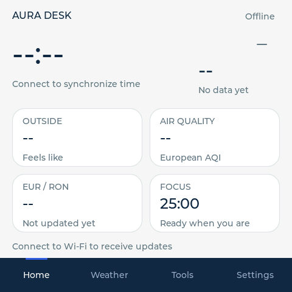
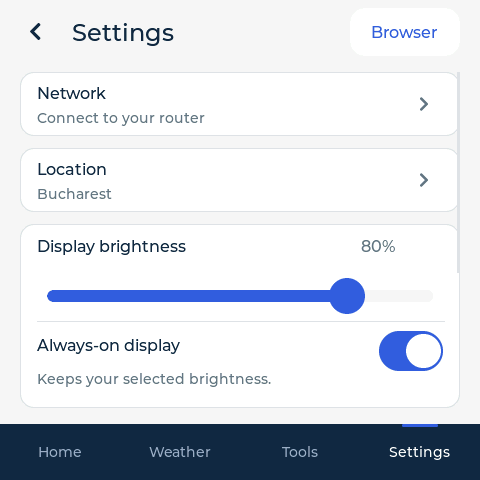

# AURA Desk — ESP32-S3 Touchscreen Firmware

An original **Horizon** interface and internet dashboard for the **Jingcai / Guition ESP32-4848S040C_I_Y_3** touchscreen: a 480 × 480 ST7701 RGB display, GT911 touch, 16 MiB flash and 8 MiB OPI PSRAM.

AURA connects to your 2.4 GHz Wi-Fi router and combines a clock, weather, air quality, reference exchange rates, public JSON API widgets and practical timers. It runs locally on the ESP32-S3 and includes paired HTTPS browser management and dual-slot OTA updates.

| Home | Settings |
| --- | --- |
|  |  |

These are host-rendered offline previews of the actual LVGL interface. Test fixture data is excluded from the device application.

## Features

- Wi-Fi setup on the touchscreen, network scanning, saved credentials and automatic reconnection.
- Network clock/calendar, editable city and supported daylight-saving rules.
- Open-Meteo weather, three forecast days, sunrise/sunset, European AQI and PM2.5.
- Dated ECB EUR/RON and EUR/USD reference rates.
- Two configurable public HTTPS JSON API widgets, with dot-path field selection and controlled refresh intervals.
- Focus sessions with 25/50-minute presets, 5/15-minute countdowns and a stopwatch using monotonic time.
- Saved brightness and **Always-on display** choice. On retains selected brightness; Off dims after three minutes without touch.
- A visible **Settings → Browser** shortcut for the current local HTTPS address and six-digit pairing code.
- Authenticated settings export, device health, and verified application OTA updates.

Cards show source dates and data ages. Invalid data stays unavailable. Open-Meteo hosted free access is for personal, non-commercial use; API/provider scope is documented in the [manual](docs/AURA_DESK.md).

## Download and setup

**Current version: 1.0.2.** Download verified files from [GitHub Releases](https://github.com/rlvphotoart/esp32-s3-touchscreen-aura-desk/releases).

- `AuraDesk.ino.bin`: application image for the device's browser OTA updater.
- `AuraDesk.ino.merged.bin`: 16 MiB factory image for the exact supported board/layout.
- `AURA-Desk-1.0.2.zip`: firmware, source, pinned dependency information and validation report.
- SHA-256 files establish integrity; releases are not publisher-signed.

Connect through **Settings → Network** using a 2.4 GHz network. Set your weather city in **Settings → Location**. Open the always-visible **Browser** button in Settings to pair a phone/computer on the same router. The local browser uses the device's own HTTPS certificate.

**Use only the matching board and flash layout.** Ordinary Arduino CLI upload uses different offsets from this project's custom layout. Factory flashing replaces stored settings; take and verify a complete backup first. Use application-only browser OTA for later updates. [Recovery guide](docs/RECOVERY.md)

## Build and verify

The isolated toolchain pins Arduino-ESP32 **3.1.1**, its matching official high-performance SDK, ESP32_Display_Panel, LVGL **8.4.0** and ArduinoJson **7.4.2**. The SDK uses PSRAM XIP; usable heap PSRAM is therefore smaller than physical capacity.

```sh
./scripts/build.sh
.venv/bin/python tools/render_ui.py
```

Follow [FIRMWARE_BUILD.md](docs/FIRMWARE_BUILD.md) and [SETUP.md](docs/SETUP.md) to install the pinned local tools. Export your board's own identity before identity-checked maintenance operations:

```sh
export ESP32_PORT='<your-serial-port>'
export AURA_EXPECTED_MAC='<your-board-mac>'
./scripts/backup_flash.sh
./scripts/verify_backup.sh
./scripts/restore_original.sh  # review only; execution requires its explicit flag
```

No owner-specific MAC, local network address, credentials, raw backup or private capture is included. Application binaries and debug metadata are audited for local build paths before release packaging.

## Tested hardware

| Component | Target |
| --- | --- |
| MCU | ESP32-S3, 240 MHz; tested revision v0.2 |
| Flash / PSRAM | 16 MiB flash / physical 8 MiB OPI PSRAM |
| Display | 480 × 480 ST7701, three-wire SPI control + RGB |
| Touch | GT911 over I2C |
| Serial | Board USB-UART bridge |
| App layout | Two 5 MiB OTA slots, NVS, LittleFS cache and coredump |

Native USB pins overlap this board's display/touch wiring. Other boards need a reviewed pin/display profile and their own validation. Physical PCB revision remains unverified.

## Documentation and history

- [Manual](docs/AURA_DESK.md), [current validation](docs/RELEASE_VALIDATION.md), [UI QA](docs/UI_QA.md).
- [Changelog](CHANGELOG.md), [1.0.0 validation](docs/RELEASE_VALIDATION_1.0.0.md), [1.0.1 validation](docs/RELEASE_VALIDATION_1.0.1.md).
- [Build guide](docs/FIRMWARE_BUILD.md), [dependency lock](docs/TOOLCHAIN_LOCK.json), [third-party notices](THIRD_PARTY_NOTICES.md).
- [Hardware](docs/HARDWARE.md), [GPIO map](docs/GPIO_MAP.md), [backup](docs/BACKUP.md), [security](docs/SECURITY.md), [recovery](docs/RECOVERY.md).

Original source/UX rights are recorded in [ORIGINAL_CODE_RIGHTS.md](ORIGINAL_CODE_RIGHTS.md), with upstream dependency licenses in [THIRD_PARTY_NOTICES.md](THIRD_PARTY_NOTICES.md). Public source history contains recovered release snapshots and the current changes. Private full-flash backups stay with the owner.
