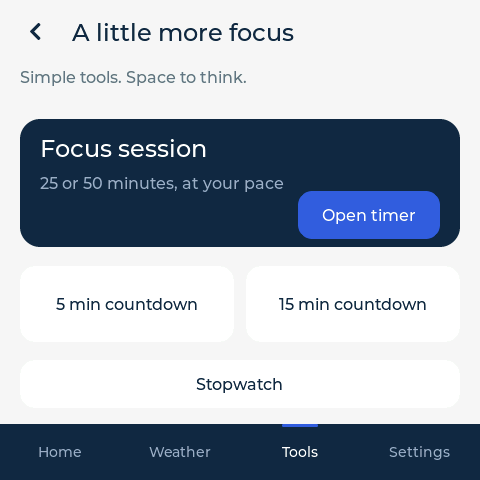

# AURA Desk 1.0.2 — release validation

Validated on 2026-10-03 against the connected ESP32-S3 / Jingcai ESP32-4848S040C_I_Y_3 touchscreen. Version 1.0.2 is installed and accepted. It fixes the countdown-to-Focus transition and repeat access to the Browser pairing page while preserving Always-on and saved configuration.

## Installed images

| Item | Result |
| --- | --- |
| Application | 1,922,208 bytes; fits both 5 MiB slots |
| Active image | ota_1, offset 0x520000, sequence 4, VALID |
| Previous image | ota_0, accepted 1.0.1 image retained |
| Backup | Fresh complete 16 MiB pre-update snapshot; full device MD5 verified |
| Installation | Paired, pinned HTTPS application OTA; healthy restart; configuration preserved |
| Irreversible security changes | No eFuse writes; Secure Boot and flash encryption unchanged |

Application SHA-256: `18f072c0d1fb4caa9e29a499359de47da2e1afe68f64729d2218b7e3ab20df0d`.

Factory merged-image SHA-256: `17e6e0e28b226a287948958b57d922ec8a13aaa32b53b93b984f6323224585bc`.

Pre-update backup SHA-256: `d59167d340f29757cf19a4789a1b749c43bf7159eadf6b317f3e89b314b844bc`. Backups remain private.

## Behavior and checks

| Check | Result and scope |
| --- | --- |
| Timer bug reproduction | Actual LVGL pointer hit tests reproduced 5/15-minute countdown → Tools → Open timer retaining Countdown |
| Timer fix | Open timer selects Focus; both 25/50-minute presets change duration; existing running Focus resumes; countdown presets and start/pause work |
| Browser bug reproduction | Actual LVGL pointer tests reproduced the Browser row becoming inaccessible at its previous position because Settings scroll reset |
| Browser fix | Visible header shortcut; five Browser/back/reopen pointer cycles; saved Settings scroll; refreshed code/address and offline hint |
| Host UI | All 14 pages, both display modes, credential preservation, masking, keyboard limits and monotonic timer regressions pass |
| Live Browser page | Two checked 480×480 private framebuffer transfers show stable current address/code after serial Settings/Home/page reentry |
| Live browser access | Pairing against the same pinned device certificate; authenticated version/settings and non-secret export pass |
| Settings preservation | Always-on enabled and selected brightness 80% before/after live navigation |
| Flash readback | Both application-slot MD5 values match their respective release images; active sequence 4 CRC valid and accepted |
| Final startup checks | Three consecutive boots; one ROM boot each; display/UI/startup health pass; zero crash markers; lowest reported minimum heap 126,636 bytes |
| Public artifact hygiene | Compiler file/debug prefix maps and normalized linker map; owner home paths absent from application, merged image, ELF and map |
| Public source/history | Private directory/binary/credential/identity audit passes; historical snapshots clearly identified |
| Licenses | 22 full upstream texts and font/notice provenance included; original source rights retained |

The first live navigation check stopped on a reset HTTPS GET connection. The complete rerun passed with zero transport retries. Checked protocol, authentication, certificate and settings failures remain immediate failures in the verifier.

Host tests exercise actual LVGL pointer hit-testing. Live device navigation checks use UART page entry/reentry and actual framebuffer/HTTPS data. Physical finger taps and touch feel/accuracy remain hands-on observations. Private screenshots, codes, addresses, certificates and sessions are excluded from source, public logs and packages.

[Structured conclusions](RELEASE_VALIDATION.json). [1.0.0 baseline](RELEASE_VALIDATION_1.0.0.md) documents the earlier ten-boot and full API checks. [1.0.1 display validation](RELEASE_VALIDATION_1.0.1.md) documents saved modes and the real three-minute idle/backlight transitions. Current final boots retain Always-on at 80%.

## Public previews

The following offline host previews use the real LVGL source and contain default offline states:

Optical brightness/color, forced failed-update rollback, deliberate power interruption and prolonged burn-in were not measured in this release run. SHA-256 files establish integrity and are not publisher signatures.
